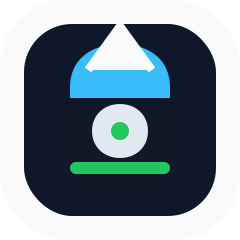
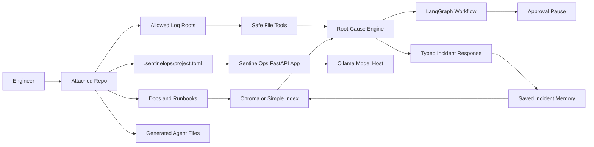

<p align="center">
  
</p>

<h1 align="center">SentinelOps</h1>

<p align="center">
  <strong>why chase outages blind when one copilot can trace the path</strong>
</p>

<p align="center">
  
  
  
  
  
</p>

<p align="center">
  <a href="#what-it-does">What It Does</a> |
  <a href="#quick-start">Quick Start</a> |
  <a href="#how-ollama-works">Ollama</a> |
  <a href="#repo-attachment">Repo Attachment</a> |
  <a href="#architecture">Architecture</a> |
  <a href="#development">Development</a> |
  <a href="#license">License</a>
</p>

---

## What It Does

SentinelOps local-first incident and operations copilot for engineering repositories. It installs as a CLI and attaches to a developer's working repository as an incident copilot.

It can:

- read the repo-local docs, runbooks, deploy files, and allowed log roots declared in `.sentinelops/project.toml`
- analyze pasted logs with `POST /analyze`
- investigate repo log files with `POST /investigate`
- run an approval-aware LangGraph workflow with `POST /workflow/investigate`
- retrieve project runbooks and prior incident memory from Chroma or a simple local index
- produce typed `root_cause_diagnostics` with causal signals, evidence strength, timelines, missing evidence, and remediation focus
- save completed investigations as repo-local incident memory for future searches
- generate Claude Code, Codex, Cursor, Windsurf, Cline, and GitHub Copilot guidance for the attached repo

The default product path is local-first and does not require login. Shared auth, remote model hosting, Postgres, and centralized telemetry are optional deployment choices for teams that need them.

## Who It Is For

SentinelOps is useful when an engineer wants a project-aware operational assistant inside the repo they already work in.

Typical use cases:

- "Why is this service failing after a deploy?"
- "Compare the current failing log with the last healthy log."
- "Find the most relevant runbook and prior incident."
- "Draft a remediation plan, but pause for approval before sensitive action."
- "Give my coding agent repo-local operational context before it suggests fixes."

## Requirements

- Python 3.11+
- `uv`
- Ollama for local model execution
- Git for repo attachment detection

Default models:

- chat/investigation: `mistral`
- embeddings: `nomic-embed-text`

Install Ollama from [ollama.com](https://ollama.com), then make sure it is running:

```bash
ollama serve
```

## Quick Start

Install SentinelOps:

```bash
uv tool install --from https://github.com/saikumar1767/Sentinel-Ops/archive/refs/heads/main.zip sentinel-ops
```

Attach SentinelOps inside a project you are already working on:

```bash
cd your-project
sentinelops attach --agent all --knowledge-backend chroma
sentinelops pull-models
sentinelops doctor
sentinelops start --no-browser
```

Open:

- console: [http://127.0.0.1:8000/console](http://127.0.0.1:8000/console)
- API docs: [http://127.0.0.1:8000/docs](http://127.0.0.1:8000/docs)

Windows installer:

```powershell
irm https://raw.githubusercontent.com/saikumar1767/Sentinel-Ops/main/scripts/install_sentinelops.ps1 | iex
```

macOS / Linux installer:

```bash
curl -fsSL https://raw.githubusercontent.com/saikumar1767/Sentinel-Ops/main/scripts/install_sentinelops.sh | bash
```

## How Ollama Works

For normal developer usage, Ollama runs once on the developer's machine and serves every project through the same local endpoint:

```text
http://localhost:11434
```

That means a developer can attach SentinelOps to many different repos, while all of them reuse the same local Ollama service.

Example:

```text
Laptop
|-- Ollama running once at localhost:11434
|-- repo-a/.sentinelops/project.toml
|-- repo-b/.sentinelops/project.toml
`-- repo-c/.sentinelops/project.toml
```

Each repo gets its own SentinelOps config, runtime state, Chroma data, workflow checkpoints, audit data, and incident memory under that repo's `.sentinelops/` directory.

If a company hosts Ollama or another compatible model service centrally, attach the repo with that endpoint:

```bash
sentinelops attach --agent all --knowledge-backend chroma --ollama-host https://models.example.internal
```

Docker is not required for normal users. Docker is only used by maintainers and CI to smoke-test the packaged service in a clean container environment.

## Repo Attachment

`sentinelops attach` is the main setup command for a working project.

It creates or updates:

- `.sentinelops/project.toml`
- `.sentinelops/agent-context.md`
- `.gitignore` entry for `.sentinelops/`
- `AGENTS.md`
- `CLAUDE.md`
- `.claude/skills/`
- `.claude/agents/`
- `.agents/plugins/marketplace.json`
- `plugins/sentinelops-copilot/`
- `.cursor/rules/`
- `.windsurf/rules/`
- `.clinerules/`
- `.github/copilot-instructions.md`

Shared instruction files are merged with SentinelOps-marked blocks. Dedicated generated files are preserved unless you pass `--overwrite`.

SentinelOps does not change your application code, authentication, authorization, deployment manifests, or business logic during attach.

## Project Config

The repo-local control plane is `.sentinelops/project.toml`.

Example:

```toml
schema_version = "2"
mode = "personal"

[workspace]
name = "checkout-service"
doc_roots = ["README.md", "docs", "runbooks", ".github/workflows", "compose.yaml"]

[logs]
roots = ["logs", "data/logs"]

[models]
analyze = "mistral"
investigate = "mistral"
embedding = "nomic-embed-text"

[runtime]
ollama_host = "http://localhost:11434"

[knowledge]
backend = "chroma"
chroma_client_mode = "persistent"
chroma_auto_start = false

[storage]
incident_history_dir = "data/runtime/recent_incidents"
workflow_checkpoint_path = "data/runtime/workflow/checkpoints.sqlite"
audit_db_path = "data/runtime/audit/audit.sqlite"
knowledge_index_path = "data/runtime/knowledge/knowledge_index.json"
chroma_path = "data/runtime/chroma"
```

## Commands

```bash
sentinelops attach --agent all --knowledge-backend chroma
sentinelops pull-models
sentinelops doctor
sentinelops paths
sentinelops start --no-browser
sentinelops install-agent --agent all --overwrite
sentinelops version
```

Use `sentinelops doctor` whenever you want to confirm that Ollama, models, retrieval, and API capabilities are ready.

## API And Console

Core routes:

- `GET /health`
- `GET /ready`
- `GET /ready/strict`
- `GET /console`
- `GET /console/overview`
- `GET /console/incidents`
- `GET /console/timeline`
- `POST /knowledge/ingest`
- `POST /knowledge/search`
- `POST /analyze`
- `POST /investigate`
- `POST /workflow/investigate`
- `POST /workflow/{thread_id}/approve`
- `GET /workflow/{thread_id}/audit`
- `GET /workflow/threads`
- `GET /metrics`

Investigation and completed workflow responses include `root_cause_diagnostics`.

## Architecture



Main internal pieces:

- FastAPI application and console
- Pydantic settings and schemas
- safe local file tools
- deterministic root-cause engine
- Ollama gateway
- Chroma or simple local retrieval
- LangGraph workflow orchestration
- SQLite persistence for local workflow, audit, and incident state

## Root-Cause Diagnostics

The deterministic root-cause engine extracts:

- failure signals such as database pool exhaustion, missing deployment config, schema mismatch, DNS failure, queue backlog, authentication abuse, disk pressure, and memory pressure
- incident type and severity
- regression evidence from before/after log comparison
- source citations for every signal
- causal timeline
- missing evidence
- remediation focus

This produces the `root_cause_diagnostics` object used by `/investigate`, `/workflow/*`, saved incidents, and incident memory.

## Incident Memory

When an investigation completes, SentinelOps saves a structured incident summary under the attached repo's runtime directory.

Saved summaries include:

- request
- candidate log paths
- incident type and severity
- manager summary
- suspected root cause
- top error lines
- next steps
- source citations
- root-cause diagnostics
- confidence

When `incident_memory_auto_index=true`, saved incident summaries are upserted into the active retrieval backend as `prior_incident` documents.

## Security Model

Local personal mode:

- auth is disabled by default
- runtime state is repo-local
- no shared server is required
- model calls go to the configured Ollama endpoint

Shared deployment mode:

- enable OIDC
- use HTTPS
- use managed secrets
- use shared Postgres if multiple users need centralized state
- define retention and redaction policy for logs, prompts, retrieval artifacts, and saved incident memory

Runtime hardening includes bounded request bodies, standard browser security headers, constant-time API-key/token comparison, SQLite WAL, foreign keys, and busy timeouts.

## Development

Clone and run from source:

```bash
git clone https://github.com/saikumar1767/Sentinel-Ops.git
cd Sentinel-Ops
uv sync
uv run sentinelops
```

Attach the source checkout to itself for local development:

```bash
uv run sentinelops attach --project-root . --agent all --knowledge-backend chroma
uv run sentinelops pull-models
uv run sentinelops doctor
```

Run tests:

```bash
uv run pytest -q
```

Run deterministic product reports:

```bash
uv run python scripts/run_eval_summary.py
uv run python scripts/run_operations_report.py
```

Run the strict live repo check:

```bash
uv run python scripts/run_repo_live_check.py --use-installed-cli --knowledge-backend chroma
```

This creates a dummy repo, attaches SentinelOps, starts the API, ingests knowledge, runs analyze/investigate/workflow checks, verifies root-cause diagnostics, checks saved incident memory, and stops the app.

## Docker

Docker is a maintainer and CI validation path, not the normal way developers use SentinelOps.

Build the image:

```bash
docker build -t sentinelops-ci .
```

Run a health smoke test:

```bash
docker run --rm -p 8000:8000 sentinelops-ci
curl http://127.0.0.1:8000/health
```

For normal project usage, install the CLI on your machine and run SentinelOps directly in the repo you are working on.

## Documentation

- [Architecture](docs/architecture.md)
- [Repo Copilot Validation](docs/repo-copilot-validation.md)
- [Commercial And Enterprise Usage](docs/commercial-and-enterprise-usage.md)
- [Operator Walkthrough](docs/operator-walkthrough.md)
- [Incident Library](docs/incident-library.md)
- [Security Notes](SECURITY.md)

## Repository Layout

```text
app/        FastAPI app, CLI, services, workflows, retrieval, console assets
config/     checked-in local and production config profiles
data/       packaged incident templates, knowledge, logs, and fixtures
docs/       architecture, validation, walkthrough, and rollout docs
scripts/    installers, reports, and live validation scripts
tests/      API, runtime, workflow, retrieval, and plug-and-play tests
```

## License

SentinelOps source code in this repository is licensed under Apache-2.0.

- [LICENSE](LICENSE)
- [NOTICE](NOTICE)
- [SECURITY.md](SECURITY.md)
