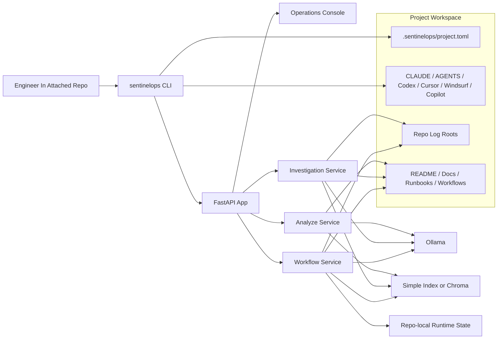
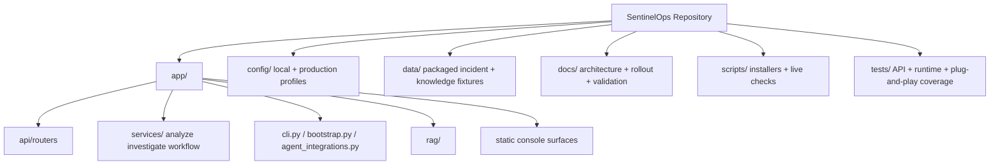
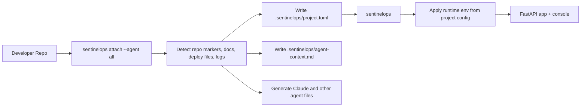
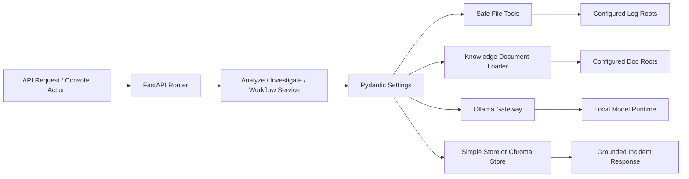
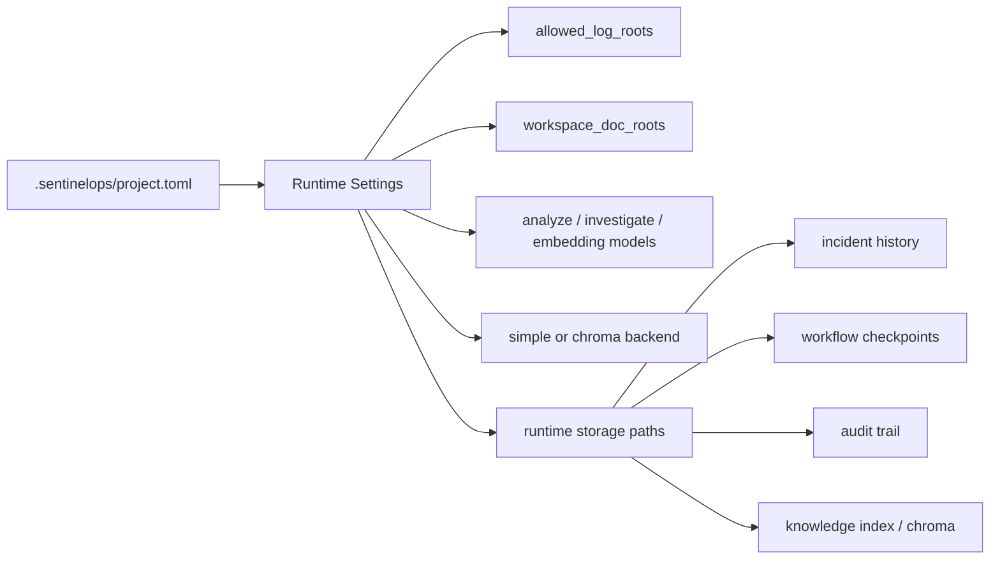

<p align="center">
  
</p>

<h1 align="center">SentinelOps</h1>

<p align="center">
  <strong>why chase outages blind when one copilot can trace the path</strong>
</p>

<p align="center">
  
  
  
  
  
  
</p>

<p align="center">
  <a href="#install">Install</a> &middot;
  <a href="#operating-modes">Modes</a> &middot;
  <a href="#single-project-config">Single Config</a> &middot;
  <a href="#architecture">Architecture</a> &middot;
  <a href="#agent-integrations">Agent Integrations</a> &middot;
  <a href="#verification">Verification</a> &middot;
  <a href="#docs">Docs</a>
</p>

---

SentinelOps is a local-first incident and operations copilot that attaches directly to an engineer's repository.

The intended default flow is:

- install `sentinelops`
- pull the configured local models once
- run `sentinelops attach --agent all` in your project
- let `.sentinelops/project.toml` become the repo-local control plane
- start `sentinelops` and use the console, API, or generated Claude/Codex/editor integrations

The local-first path does not require login. Shared auth, OIDC, and centralized infrastructure remain optional overlays for companies that later choose a shared deployment.

## Technologies Used

| Area | Technology |
| --- | --- |
| API shell | FastAPI, Uvicorn |
| Config and contracts | Pydantic, Pydantic Settings |
| Model runtime | Ollama |
| Workflow orchestration | LangGraph |
| Retrieval | Chroma `0.4.24` pinned for stable local persistent storage, or simple local index |
| Persistence | SQLite by default, Postgres optional |
| Observability | OpenTelemetry |
| Packaging | `uv`, Hatchling |
| Testing | Pytest, httpx |

## Operating Modes

| Mode | What it is | Login required? | Best fit |
| --- | --- | --- | --- |
| `personal` | Local-first repo copilot on one engineer's PC | No | Default office-PC usage across individual projects |
| `shared` | Optional centralized rollout with shared persistence and auth | Yes | Multi-user internal deployment with governance needs |

Personal mode is the primary path. Shared mode is an optional second layer.

## Install

| Platform | Command |
| --- | --- |
| Windows PowerShell | `irm https://raw.githubusercontent.com/saikumar1767/Sentinel-Ops/main/scripts/install_sentinelops.ps1 \| iex` |
| macOS / Linux | `curl -fsSL https://raw.githubusercontent.com/saikumar1767/Sentinel-Ops/main/scripts/install_sentinelops.sh \| bash` |
| Direct with `uv` | `uv tool install --from https://github.com/saikumar1767/Sentinel-Ops/archive/refs/heads/main.zip sentinel-ops` |

Recommended first-run flow inside a repo:

```bash
cd your-project
sentinelops attach --agent all --knowledge-backend chroma
sentinelops pull-models
sentinelops doctor
sentinelops
```

Helpful follow-up commands:

```bash
sentinelops paths
sentinelops install-agent --agent all --overwrite
sentinelops start --no-browser
```

If SentinelOps runs in a container while Ollama runs on the host machine, attach with:

```bash
sentinelops attach --agent all --knowledge-backend chroma --ollama-host http://host.docker.internal:11434
```

Docker validation also requires the container to reach PyPI during image build and reach the host Ollama endpoint during live checks. If those two network paths are blocked, fix Docker Desktop networking before treating the container result as a product failure.

## Single Project Config

SentinelOps treats `.sentinelops/project.toml` as the single repo-local control file for:

- project name and mode
- doc roots and log roots
- Ollama models
- Ollama host
- retrieval backend and Chroma settings
- repo-local runtime storage paths

Example generated shape:

```toml
schema_version = "2"
mode = "personal"

[workspace]
name = "checkout-service"
doc_roots = [
  "README.md",
  "docs",
  "runbooks",
  ".github/workflows",
  "compose.yaml",
]

[logs]
roots = [
  "logs",
  "data/logs",
]

[models]
analyze = "mistral"
investigate = "mistral"
embedding = "nomic-embed-text"

[runtime]
ollama_host = "http://localhost:11434"

[knowledge]
backend = "chroma"
chroma_client_mode = "persistent"
chroma_host = "127.0.0.1"
chroma_port = 8012
chroma_ssl = false
chroma_auto_start = false

[storage]
incident_history_dir = "data/runtime/recent_incidents"
workflow_checkpoint_path = "data/runtime/workflow/checkpoints.sqlite"
audit_db_path = "data/runtime/audit/audit.sqlite"
knowledge_index_path = "data/runtime/knowledge/knowledge_index.json"
chroma_path = "data/runtime/chroma"
```

What `sentinelops attach` does:

- creates `.sentinelops/`
- writes `.sentinelops/project.toml`
- writes `.sentinelops/agent-context.md`
- adds `.sentinelops/` to the repo `.gitignore`
- detects common docs, runbooks, deploy files, and log roots
- optionally stamps the retrieval backend and Chroma runtime choices
- generates Claude Code, Codex, Cursor, Windsurf, Cline, and Copilot integrations

## Architecture

### High-level system map



### Repository architecture



### Attach and bootstrap flow



### Runtime request flow



### Data and storage flow



More detailed breakdowns live in [docs/architecture.md](docs/architecture.md).

## Agent Integrations

`sentinelops attach --agent all` wires multiple tools at once.

| Agent / Tool | Generated Surface | What it Gives You |
| --- | --- | --- |
| Claude Code | `.claude/skills/`, `.claude/agents/`, merged `CLAUDE.md` block | Repo-local SentinelOps skills, a dedicated ops subagent, and always-on project memory |
| Codex | `.agents/plugins/marketplace.json`, `plugins/sentinelops-copilot/` | Repo-local plugin, skill, commands, and marketplace entry |
| Cursor | `.cursor/rules/sentinelops.mdc` | Always-on repo rule for ops and incident work |
| Windsurf | `.windsurf/rules/sentinelops.md` | Repo-local ops-copilot instruction file |
| Cline | `.clinerules/sentinelops.md` | Repo-local investigation and readiness workflow guidance |
| GitHub Copilot | `.github/copilot-instructions.md` | Merged SentinelOps block for repo-local operational context |
| Cross-agent | `AGENTS.md` | Shared repo guidance that other tools can read directly |

Safety behavior:

- shared files like `AGENTS.md`, `CLAUDE.md`, `.agents/plugins/marketplace.json`, and `.github/copilot-instructions.md` are merged instead of blindly replaced
- dedicated generated files are preserved unless you re-run with `--overwrite`

## Core Product Surfaces

- Operations console: `/console`
- Console overview: `/console/overview`
- Incident library: `/console/incidents`
- Incident timeline: `/console/timeline`
- Fast analysis: `POST /analyze`
- One-shot investigation: `POST /investigate`
- Workflow investigation: `POST /workflow/investigate`
- Workflow thread history: `GET /workflow/threads`
- Current user: `/me`
- Evaluation summary: `/eval/summary`
- Metrics: `/metrics`

## Optional Shared Deployment

The shared mode exists for teams that later want one centralized deployment. It is optional and sits on top of the local-first product.

```bash
sentinelops start --profile production
```

Shared-mode requirements:

- `deployment_mode=production`
- `auth_mode=oidc`
- shared Postgres metadata and workflow checkpoint stores
- `https://` public base URL
- OTLP telemetry export
- managed secrets

Starter company-style Docker stack:

```bash
docker compose up --build sentinelops-postgres sentinelops-keycloak sentinelops-api
```

## Run From Source

```bash
uv sync
uv run sentinelops pull-models
uv run sentinelops
```

Open:

- [http://127.0.0.1:8000/console](http://127.0.0.1:8000/console)
- [http://127.0.0.1:8000/docs](http://127.0.0.1:8000/docs)

## Verification

Local verification:

```bash
uv run pytest -q
uv run pytest -q tests/test_console_surface.py
uv run pytest -q tests/test_runtime_surface.py
uv run pytest -q tests/test_workflow_api.py
uv run python scripts/run_eval_summary.py
uv run python scripts/run_operations_report.py
```

Repo-local acceptance path:

```bash
sentinelops attach --agent all --knowledge-backend chroma
sentinelops pull-models
sentinelops paths
sentinelops doctor
sentinelops start --no-browser
```

Strict live dummy-repo validation:

```bash
uv run python scripts/run_repo_live_check.py --pull-models
```

Optional live dependency test:

```bash
set SENTINELOPS_RUN_LIVE_TESTS=1
uv run pytest -q tests/test_live_stack.py
```

## Docs

- Architecture: [docs/architecture.md](docs/architecture.md)
- Repo copilot validation: [docs/repo-copilot-validation.md](docs/repo-copilot-validation.md)
- Commercial and enterprise usage: [docs/commercial-and-enterprise-usage.md](docs/commercial-and-enterprise-usage.md)
- Operator walkthrough: [docs/operator-walkthrough.md](docs/operator-walkthrough.md)
- Incident library: [docs/incident-library.md](docs/incident-library.md)
- Video walkthrough: [docs/video-walkthrough.md](docs/video-walkthrough.md)
- Interview story: [docs/interview-story.md](docs/interview-story.md)
- Resume bullets: [docs/resume-bullets.md](docs/resume-bullets.md)

## Repo Layout

- `app/` API shell, services, workflow orchestration, static console assets, CLI, and agent integrations
- `config/` checked-in non-secret app config for local and production profiles
- `data/incident_library/` packaged incident profiles
- `data/knowledge/` packaged runbooks, notes, and reference docs
- `docs/` architecture, rollout, validation, and communication assets
- `samples/` starter logs and local demo artifacts
- `scripts/` installers, startup helpers, and live validation commands
- `tests/` API, runtime, workflow, and plug-and-play verification coverage

## License

SentinelOps source in this repository is licensed under Apache-2.0.

- License text: [LICENSE](LICENSE)
- Distribution notice: [NOTICE](NOTICE)
- Security guidance: [SECURITY.md](SECURITY.md)

Commercial use still requires review of deployed models, connected data, and third-party services. See [docs/commercial-and-enterprise-usage.md](docs/commercial-and-enterprise-usage.md).
