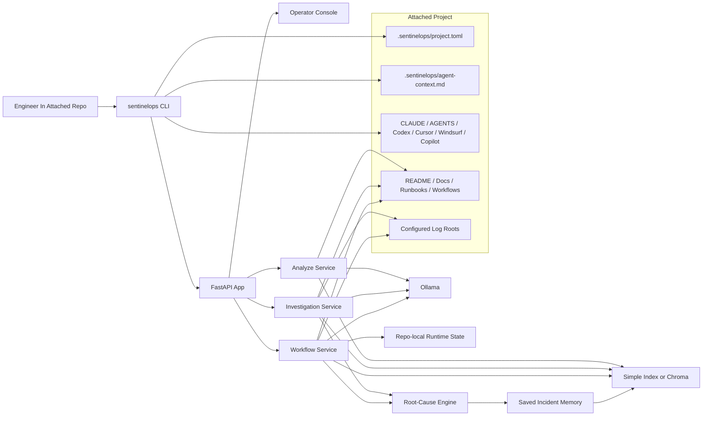
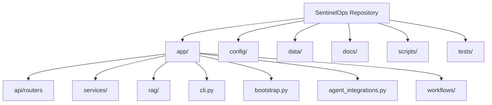
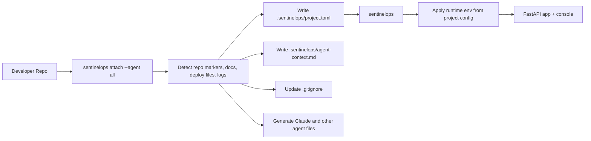
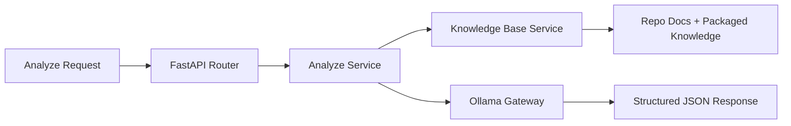
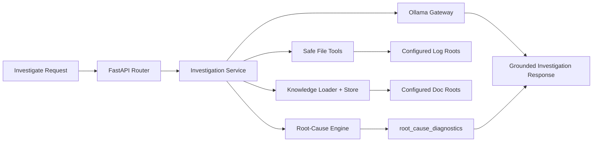
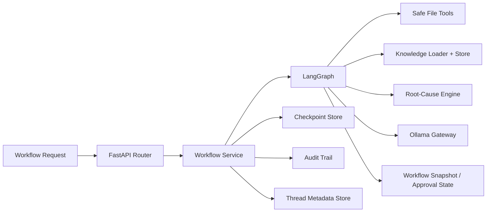
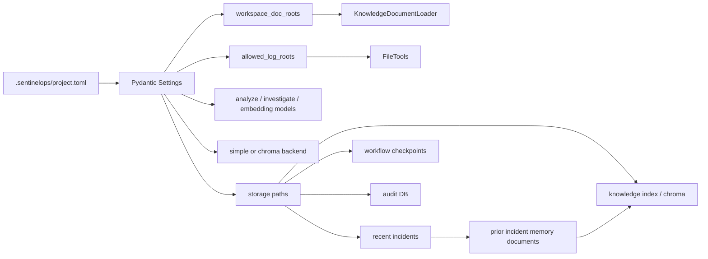
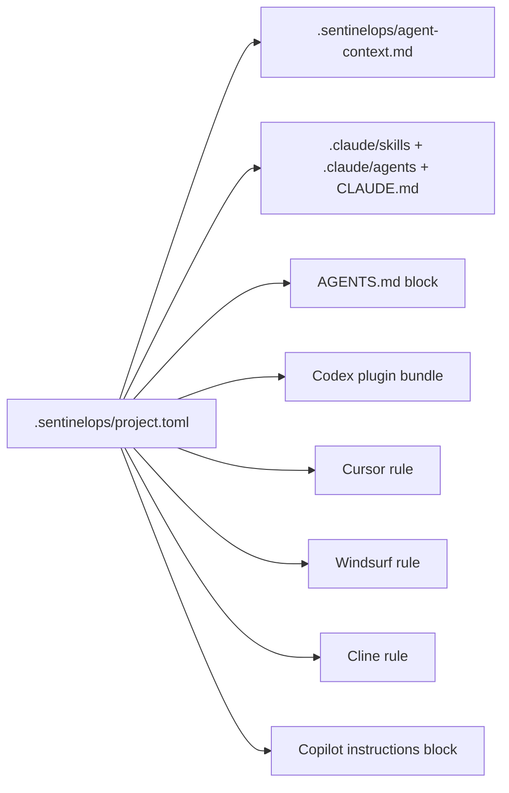
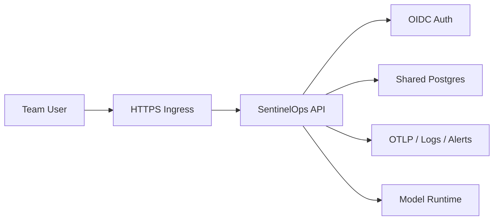

# SentinelOps Architecture

## Design Goal

SentinelOps is designed to feel simple on one engineer's machine and still preserve a clean path to a stricter shared deployment later.

The primary design choice is:

- local-first by default
- one repo-local control file
- safe file and workflow boundaries
- deterministic root-cause analysis before model summarization
- incident memory that feeds future retrieval
- optional shared mode only when a team truly needs it

## Operating Modes

| Mode | Primary user | Default auth | Default storage | Why it exists |
| --- | --- | --- | --- | --- |
| `personal` | One engineer on one office PC | disabled | repo-local `.sentinelops/` | Fast plug-and-play use inside that engineer's own repositories |
| `shared` | Multi-user internal rollout | OIDC | shared Postgres and centralized telemetry | Team-wide deployment, governance, and centralized operations |

The rest of this document is organized around the local-first path first, then the optional shared overlay.

## High-level Product Map

## Repository Architecture

## Repo-local Control Plane

The repo-local control plane is intentionally narrow. Instead of scattering project-specific runtime knowledge across multiple hidden files, SentinelOps keeps that contract in `.sentinelops/project.toml`.

That file controls:

- workspace name
- mode
- doc roots
- log roots
- default models
- Ollama host
- retrieval backend and Chroma connection settings
- repo-local storage paths

### Attach and bootstrap flow

### Why this matters

- install flow stays repeatable
- the project itself declares what SentinelOps should read
- engineers can adjust resources without editing product code
- generated agent files can point back to one shared contract

## Request-processing Architecture

SentinelOps has three main operational paths.

### 1. Analyze path

`POST /analyze` is the fast triage route for pasted evidence.

### 2. Investigate path

`POST /investigate` is the repo-aware operator route.

The one-shot route reads configured log evidence, compares supplied runs when possible, retrieves runbooks and prior incident memory, runs deterministic causal analysis, and then asks the model to summarize with that evidence already structured.

### 3. Workflow path

`/workflow/*` is the durable, approval-aware route.

The LangGraph route has an explicit `analyze_root_cause` stage between retrieval and hypothesis drafting. That stage stores deterministic diagnostics in workflow state so the final report, saved incident, audit-visible thread state, and thread history all carry the same causal record.

### Root-cause diagnostics contract

`root_cause_diagnostics` is intentionally typed and inspectable. It contains:

- `generated_by`, currently `deterministic_root_cause_engine`
- inferred incident type and severity
- evidence strength from extracted signals, regression deltas, and timeline density
- primary root cause and ranked hypotheses
- normalized evidence signals with source citations
- timeline entries and missing-evidence notes

This keeps the "brain" of SentinelOps split cleanly: deterministic code extracts and scores operational facts, while the model turns those facts into readable operator language.

## Data and Storage Architecture

The runtime pulls from two broad sources:

- project-scoped operational context
- packaged SentinelOps knowledge and fixtures

### Packaged data versus attached project data

| Source | Role |
| --- | --- |
| `data/knowledge/` | packaged runbooks and reference knowledge |
| `data/incident_library/` | packaged incident profiles |
| `data/reference_incidents/` | packaged examples for comparison and evaluation |
| attached repo doc roots | project-specific operational context |
| attached repo log roots | project-specific live or recent evidence |
| saved incident summaries | repo-local incident memory that can be upserted into retrieval |

## Agent and Editor Integration Architecture

Generated integrations are product surfaces, not side artifacts.

The contract is simple:

- SentinelOps writes the repo-local config and context
- generated tools point back to those files
- shared files are merged, not blindly overwritten

## Shared-mode Overlay

Shared mode is intentionally a second layer, not the default product assumption.

Use shared mode only when you need:

- one deployment for multiple users
- centralized approvals
- centralized audit history
- shared operational dashboards

## Design Decisions

### 1. Local-first is the default product, not the demo mode

The easiest real use case is one engineer attaching SentinelOps to one repo on one PC. The architecture treats that as the main product path.

### 2. One repo config beats scattered hidden behavior

`.sentinelops/project.toml` is the local control plane so engineers can see and edit what SentinelOps reads, where it stores state, and which local services it expects.

### 3. Retrieval is explicit and bounded

SentinelOps favors configured repo docs, known deploy files, and safe log roots over broad filesystem scanning or generic guesswork.

### 4. Causal analysis is deterministic before it is conversational

Root-cause detection is not left entirely to a prompt. SentinelOps extracts known failure signals, compares before/after log evidence, records missing evidence, and emits typed diagnostics that the model must stay grounded in.

### 5. Workflow stays inspectable

Durable workflow state, approval pauses, and auditability matter more than pretending the product is fully autonomous.

### 6. Incident memory is repo-local by default

Completed investigations are saved under repo-local runtime storage and can be indexed into the active knowledge backend. This makes repeat incidents faster to recognize without creating a hidden global memory.

### 7. Runtime hardening belongs in the product shell

The API adds bounded request bodies, security headers, constant-time token comparisons, SQLite WAL, foreign keys, and busy timeouts so local-first does not mean careless runtime behavior.

### 8. Shared mode is an overlay

OIDC, shared Postgres, and telemetry remain supported, but only for deployments that actually need them.

## What Still Remains

For the local-first product:

- richer project-config validation in `doctor`
- background workers for long-running jobs
- more built-in integrations for real project systems
- stronger policy-gated action execution
- broader incident-signal libraries for domain-specific services

For the shared overlay:

- fully managed identity bootstrap
- formal database migrations and restore drills
- centralized logs, traces, dashboards, and alerts
- governance for retention, redaction, and internal legal/security review
