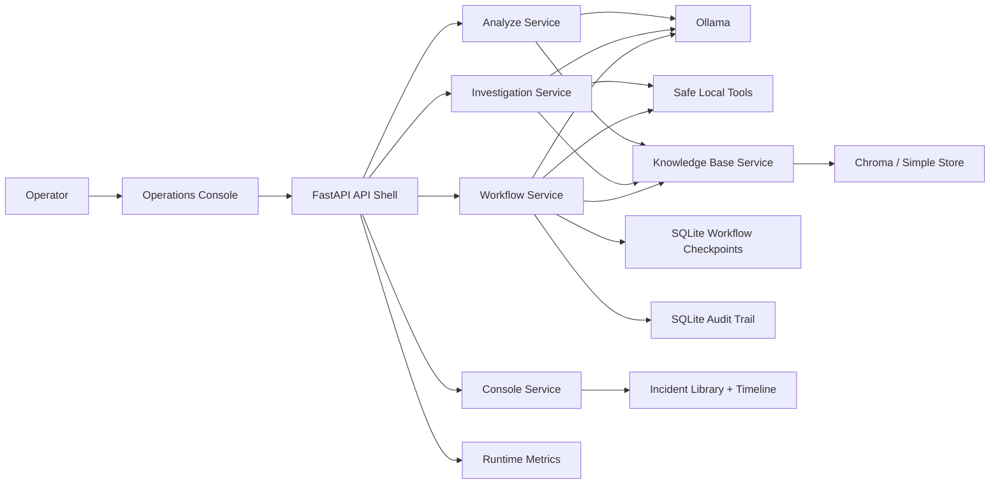

# SentinelOps Architecture

## Problem

SentinelOps helps an operator move from raw incident evidence to a grounded response quickly:
- classify the incident
- gather safe evidence from logs and local tools
- retrieve supporting runbooks and notes
- generate structured summaries or remediation plans
- pause for approval before sensitive remediation work completes

## Why this architecture works

The system is designed to be practical on constrained hardware:
- Ollama runs outside Docker so local GPU access stays simple
- Chroma stays local and lightweight
- FastAPI owns transport, contracts, docs, and the console surface
- LangGraph is used only where checkpoints and approval pauses add real value
- recorded incident profiles keep the operator console reproducible

## System view

## Core layers

### API shell

FastAPI handles:
- route definitions
- OpenAPI docs
- problem-detail errors
- readiness and metrics endpoints
- the operations console entrypoint

### Analysis layer

`/analyze` is the fast path:
- accept pasted log text
- retrieve supporting evidence when available
- return structured JSON for quick triage

### Investigation layer

`/investigate` is the one-shot operator path:
- read local logs
- compare current vs previous runs
- retrieve knowledge
- produce grounded next steps

### Workflow layer

`/workflow/*` is the durable copilot path:
- checkpoint state in SQLite
- expose thread inspection
- pause for approval when remediation is risky
- persist audit events for approve, reject, and resume

### Console layer

The console adds:
- a live operations console
- an incident library
- a saved incident timeline
- an overview built from deterministic evaluation results

## Main design decisions

### 1. Local-first instead of cloud-first

The product is optimized for repeatable operation on one machine. That reduces infrastructure noise and keeps the focus on incident quality.

### 2. Retrieval is supportive, not magical

SentinelOps still works when retrieval is unavailable. The system degrades safely and marks retrieval status clearly.

### 3. Workflow before autonomy

The workflow is controlled and approval-aware. It is designed to be inspectable and safe, not autonomous for the sake of sounding advanced.

### 4. Operator-facing assets are first-class

The console, incident library, timeline, evals, and launch scripts are part of the product surface, not afterthoughts.

## Operational proof

Strong proof points in the repo:
- deterministic eval summary via `/eval/summary`
- incident library via `/console/incidents`
- incident timeline via `/console/timeline`
- runtime metrics via `/metrics`
- live Ollama/Chroma coverage in `tests/test_live_stack.py`

## Next production steps

- managed identity and secrets
- centralized tracing and logs
- background workers for long-running analysis
- role-based approvals and multi-user attribution
