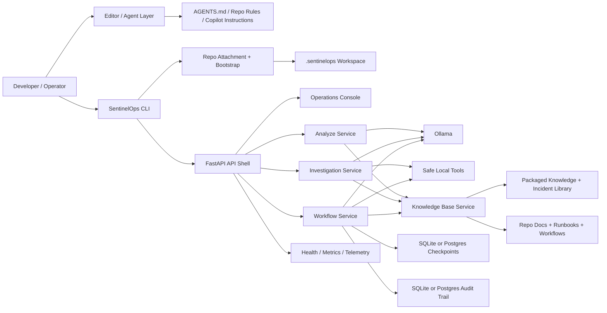

# SentinelOps Architecture

## Product Shape

SentinelOps now has three first-class operating modes:

- standalone local operator console
- repo-local operations copilot inside any project
- production-shaped internal deployment with identity, shared persistence, and telemetry guardrails

That means the architecture is no longer only "API plus local model runtime." It is also:

- a CLI product (`sentinelops`)
- a repo attachment system (`sentinelops attach`)
- a generated agent/editor integration layer (`sentinelops install-agent`)

## Problem

SentinelOps helps an operator or engineering team move from raw evidence to a grounded response quickly:

- classify the incident
- gather safe evidence from logs and repo files
- retrieve supporting runbooks and operational notes
- generate structured summaries or remediation plans
- pause for approval before sensitive remediation work completes

## Why this architecture works

The system is designed to stay practical on constrained hardware without giving up a path to company-ready deployment:

- the CLI makes install and repo attachment repeatable
- Ollama stays outside Docker for simpler local GPU access
- FastAPI owns transport, contracts, and the console/API surface
- the knowledge layer can read packaged knowledge and repo-local documents
- LangGraph is used where checkpoints and approval pauses add real value
- generated agent/editor files make the repo-local copilot mode portable

## System View

## Core Layers

### CLI and bootstrap layer

The CLI turns SentinelOps into an installable product:

- `sentinelops` starts the app
- `sentinelops attach` bootstraps `.sentinelops/` inside a repo
- `sentinelops install-agent` generates repo-local agent/editor integrations
- `sentinelops doctor` validates readiness
- `sentinelops paths` prints the active workspace contract

### API shell

FastAPI handles:

- route definitions
- OpenAPI docs
- problem-detail errors
- readiness and metrics endpoints
- the operations console entrypoint
- auth/RBAC boundary integration

### Analysis layer

`/analyze` is the fast path:

- accept pasted log text
- retrieve supporting evidence when available
- return structured JSON for quick triage

### Investigation layer

`/investigate` is the one-shot operator path:

- read repo-local or configured logs
- compare current versus previous runs
- retrieve knowledge from packaged and repo-local sources
- produce grounded next steps

### Workflow layer

`/workflow/*` is the durable copilot path:

- checkpoint state in SQLite or Postgres
- expose thread inspection
- pause for approval when remediation is risky
- persist audit events for approve, reject, and resume

### Repo-local integration layer

This layer is what makes SentinelOps plug-and-play inside another project:

- `.sentinelops/project.toml` stores the workspace contract
- `.sentinelops/agent-context.md` gives a shared repo-local briefing
- `AGENTS.md`, Copilot instructions, Cursor rules, Windsurf rules, Cline rules, and the Codex plugin bundle are generated from that contract

### Console layer

The console adds:

- a live operations console
- an incident library
- a saved incident timeline
- an overview built from deterministic evaluation results

## Main Design Decisions

### 1. Repo-local context beats global guessing

The product now treats the attached repository as the primary source of operational truth. That makes the copilot useful to engineers inside their own projects instead of only inside a dedicated demo workspace.

### 2. Retrieval is supportive, not magical

SentinelOps still works when retrieval is unavailable. The system degrades safely and marks retrieval status clearly.

### 3. Workflow before autonomy

The workflow is controlled and approval-aware. It is designed to be inspectable and safe, not autonomous for the sake of sounding advanced.

### 4. Product surfaces are part of the architecture

The CLI, console, incident library, timeline, evals, installer scripts, docs, and generated agent integrations are part of the product surface, not afterthoughts.

## Operational Proof

Strong proof points in the repo:

- deterministic eval summary via `/eval/summary`
- incident library via `/console/incidents`
- incident timeline via `/console/timeline`
- runtime metrics via `/metrics`
- repo-local integration coverage in `tests/test_agent_integrations.py`
- live Ollama and Chroma coverage in `tests/test_live_stack.py`

## Production Gaps That Still Matter

SentinelOps now has a stronger repo-local and production foundation, but company-wide rollout still needs:

- managed identity and secrets
- centralized tracing and logs
- background workers for long-running analysis
- policy-gated action execution
- stronger governance for retention, PII handling, and model/legal review
